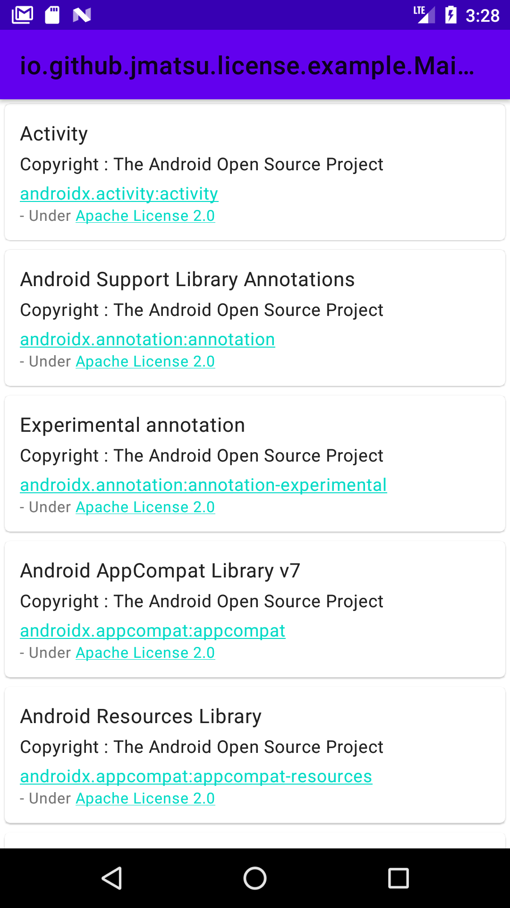
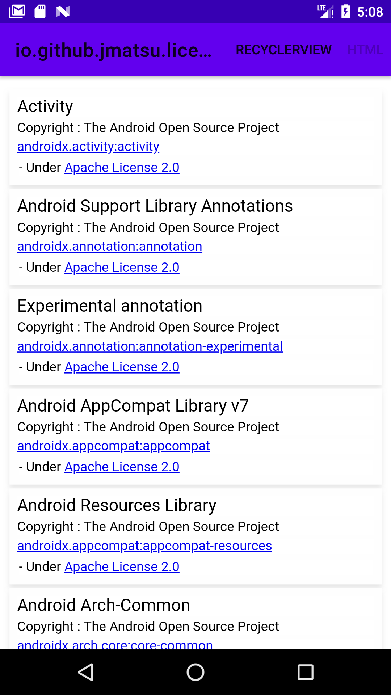

# License List Plugin

[](https://circleci.com/gh/jmatsu/license-list-plugin) 

Plugin : [](https://plugins.gradle.org/plugin/io.github.jmatsu.license-list)
Schema lib : [  ](https://bintray.com/jmatsu/maven/license-list-schema/latest/link)

License List Plugin is a Gradle plugin to manage artifacts' licenses that your Android project uses. It can generate the data source as human readable or handy format.

## Guide

1. [Introduction](#introduction)
2. [Getting Started](#getting-started)
    1. [Installation](#installation)
    2. [Continuous Management](#continuous-management)
3. [Tasks](#tasks)
    1. [Initialize](#initialize)
    2. [Validate](#validate)
    3. [Merge/Update](#mergeupdate)
    4. [Visualize](#visualize)
4. [Extension](#extension)
5. [Tips](#tips)
    1. [license-tools-plugin migration](#for-license-tools-plugin-users)
    2. [Exclude specific groups/artifacts](#exclude-specific-groupsartifacts)
    3. [Add other configurations like WearApp](#additional-configurations-like-wearapp)
    4. [Custom variant-aware configurations](#custom-variant-aware-configurations)
    5. [Html template customization](#html-customization)
    6. [Render Json output](#render-json)
6. [Known limitation](#limitations)
7. [LICENSE](#license)

## Introduction

The goals of this plugin are the following

- Easy to add/delete/change licenses through human readable text. (either of Yaml, Json)
- Flexible visualization of licenses. (Html template injection, Json export)
- Whitelabel support using productFlavors or buildTypes for Android project. (Possible to manage for each variants)

Yaml configuration example is like the following.

```
release:
    androidx.activity:
      - key: activity
        displayName: Activity
        url: https://developer.android.com/jetpack/androidx
        copyrightHolders: []
        licenses:
          - apache-2.0
```

This plugin can generate HTML or a json file for the license viewer based on the management file.

Sample view using json | The default html layout
:---|:---
 | 

## Getting Started

### Installation

#### Configure your project

Apply the plugin to "com.android.application" modules.

**For example, plugins block in Kotlin**

ref: https://plugins.gradle.org/plugin/io.github.jmatsu.license-list#kotlin-usage

```kotlin
plugins {
  id("com.android.application")
  id("io.github.jmatsu.license-list") version ("<version}>")
}
```

<details>

**Groovy**

ref: https://plugins.gradle.org/plugin/io.github.jmatsu.license-list#groovy-usage

```groovy
// Legacy groovy example.

buildscript {
  repositories {
    maven {
      url "https://plugins.gradle.org/m2/"
    }
  }
  dependencies {
    classpath "io.github.jmatsu:license-list-gradle:<version>"
  }
}

apply plugin: "com.android.application"
apply plugin: "io.github.jmatsu.license-list"
```

</details>

#### Create management files

You can generate a management file based on the current dependencies.

If you need to manage only one variant, then it's better to configure this plugin first. For example, `freeRelease` is the variant to be managed.

```kotlin
licenseList {
    defaultVariant = "freeRelease"
}
```

And then, run `./gradlew initLicenseList`. It's kinda alias of `initFreeReleaseLicenseList`. For those who need to manage multiple variants, `init<Variant>LicenseList` is available for each variants by default so please use the proper task.

#### Tweak the generated files

After runnning `initLicenseList`, you can get the management files below.

File | Description
:---|:----
`artifact-definition.yml` | Define artifacts and license *keys* to manage
`license-catalog.yml` | A list of licenses that artifacts contain
`.artifactignore` | A list of Regex to exclude artifacts from the management

- Modify the generated `artifact-definition.yml` 
    - Some of artifacts do not have enough information in their pom files.
- You may need to modify `.artifactignore` to exclude several dependencies
- You need to modify `license-catalog.yml`
    - It may contain several unsatisfactory licenses because their original definitions in the pom files are partially lacked.

#### Generate a license viewer or its resource 

Genereate the file for your license viewer by running `./gradlew visualize<Variant>LicenseList` and embed it into your application.

This plugin supports `html` and `json` as the resource format.

## Continuous management

1. Run `./gradlew validate<Variant>LicenseList` before release or on every pull requests.
2. If the validation above fails, please update `artifact-definition.yml` manually or use `./gradlew merge<Variant>LicenseList` until the validation succeeds. 
3. Regenerate the resource of your license viewer through `visualize<Variant>LicenseList`

## Tasks

This plugin follows the naming strategy of Android Gradle Plugin does as much as possible. i.e. `<actionName><Variant>LicenseList` is it.

### Initialize

`init<Variant>LicenseList`

This is the entrypoint of this plugin. It generates the base definition file and the license catalog file that you will manage.

**Do you want to overwrite it?**

If you would like to re-initialize the definition files, then please pass `-Poverwrite=true` when running this task. 

### Validate 

`validate<Variant>LicenseList`

This checks if the current definition files and the current project dependencies differ. 

NOTE: This doesn't mean your definition file *satisfy* license usages. It's your responsibility, not of this plugin.

### Merge/Update 

`merge<Variant>LicenseList`

Merge the current project dependencies into the current definition files with respecting the current definition files.

The strategy is *defensive*. This task will preserve your changes in the definition files.

### Visualize

`visualize<Variant>LicenseList`

It will create a HTML file or JSON file based on the plugin configuration. 

NOTE: [example](./example) renders its licenses based on the both of json and html.

## Extension

```kotlin
licenseList {
    // initLicenseList will be kinda alias of `initFreeReleaseLicenseList`
    defaultTarget = "<variant name like freeRelease>"

    variants {
        // you can declare the configuration for each variants
        create("freeRelease") {
            // A directory that contains artifact-definitions.yml and license-catalog.yml
            artifactDefinitionDirectory = file("license-list")

            // options for the management file
            assembly {
                // management file format
                // optional: yaml by default
                format = "<yaml|json>"

                // the style of the managed content
                // optional: structured by default
                style = "<structured|flatten>"

                // whether or not artifacts are grouped by scopes like `implementation`
                // optional: true by default
                groupByScopes = true

                // Rarely used. See Tips/Custom configurations
                // optional
                additionalScopes += setOf("customImplConfiguration")

                // Rarely used. See Tips/WearApp
                // optional
                targetConfigurations += setOf("wearApp")

                // A path to ignore file.
                // optional: project.file(".artifactignore") by default
                ignoreFile = file(".customartifactignore")
            }

            // options for the report file
            visualization {
                format = "<html|json>" // html by default

                 // the embedded template will be used by default
                htmlTemplateDir = file("</where/plugin/find/for/html-template>")

                 // To support free maker's breaking changes. rarely used.
                freeMakerVersion = "<version string>"

                // `<variant>/assets` is the default location
                outputDir = file("</where/plugin/generate/file/to>")
            }
        }
    }
}
```

## Tips

### For license-tools-plugin users

ref: [cookpad/license-tools-plugin](https://github.com/cookpad/license-tools-plugin/blob/master/LICENSE.md)

Those who are from license-tools-plugin can migrate their yml file to the format that this plugin supports.

**Configure this plugin for the migration**

```kotlin
plugins {
  id("com.cookpad.android.licensetools") // A migration task is available only when the plugin is applied
  id("io.github.jmatsu.license-list")
}

licenseTools {
  licensesYaml = ... // this propery is supported
  ignoreGroups = [...] // this property is also supported
}

licenseList {
  defaultVariant = "<please specify the variant you would like to manage>"
}
```

**Run the migration task**

Please note that the following task is available only when `license-tools-plugin` is applied

```bash
./gradlew migrateLicenseToolsDefinition
```

**Copy generated files and remove license-tools-plugin**

Generated files are available in `/path/to/app-module/build/license-list`. They are `.artifactignore`, `artifact-definition.yml`, and `license-catalog.yml`.
Please move them to the directory where you would like to use for the management. The default configuration will check `/path/to/app-module` directory.

- Only v1.7.0 is tested. Please feel free to open issues if you have any problems.
- `licenseTools.ignoreProjects` is not supported. Because I couldn't imagine the usecase that we really want to ignore *projects*. The group/artifact ignore feature is enough.

### Exclude specific groups/artifacts

You can exclude specific groups and/or artifacts through `.artifactignore` file. `.artifactignore` file is a list of Regexp that matches with `<group>:<name>`.

Let's say you want to exclude `com.example` group and `io.github.jmatsu:example` artifact. Your ignore file should be like the following.

```
com.example:.*
io.github.jmatsu:example
```

Please note that this plugin will automatically add `^` and `$` to each lines, so you must not add it in this ignore file.

For the more details, see [example/app/.artifactignore](example/app/.artifactignore).

#### Additional configurations like WearApp

For example `wearApp` is an independent from `implementation` etc. This plugin allows you to add such independent configurations to discovery targets. (No action is required if the variant's configurations extend the custom configurations.)

```kotlin
assembly {
    targetConfigurations += "wearApp"
}
```

### Custom variant aware configurations

If you have created `functionalImplementation` and `<variant>FunctionalImplementation` for each variants, `additionalScopes` will be your help.

```kotlin
assembly {
    // Elements in additionalScopes will be used to build dynamic configurations with using targetConfigurations
    // e.g. `functional` will be used to build `functionalImplementation`, `functionalTestImplementation` and so on
    additionalScopes += "functional"
}
```

### Html Customization

This plugin uses FreeMaker to generate HTML files and can accept an user-defined template like the following.

```kotlin
visualization {
    // the name of the template file must be *license.html.ftl
    htmlTemplateDir = file("customTemplateDir")
}
```

Please check the original `ftl` file for variables that you can use.

### Render Json

The schema of json objects are defined in `schema` module published to jcetner. You can chose any serialization method, custom attribute transformation, and so on.

## Limitations

- Only for Android application projects.
    - I think Java project support should also be supported but not yet planned.
- Sharing configuration between variants
- Modification detection

## License

Under MIT License.

```
 Copyright 2020 Jumpei Matsuda (jmatsu)
```

- This plugin partially uses [cookpad/license-tools-plugin](https://github.com/cookpad/license-tools-plugin/blob/master/LICENSE.md)'s source code to support migration.
- The Gradle plugin design is inspired by [Triple-T/gradle-play-publisher](https://github.com/Triple-T/gradle-play-publisher/blob/master/LICENSE).
